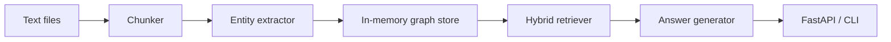

# Graph RAG Knowledge Assistant

A portfolio-ready Graph Retrieval-Augmented Generation project that combines document chunking, entity extraction, graph traversal, lexical retrieval, and optional Ollama generation.

The project is intentionally runnable without external infrastructure. By default it builds an in-memory knowledge graph from local text files. You can later connect the same flow to Neo4j and Ollama for a fuller production-style setup.

## Features

- Automatic text chunking with stable chunk IDs
- Lightweight entity extraction for people, organizations, tools, and concepts
- Knowledge graph construction between documents, chunks, and entities
- Hybrid retrieval using keyword scoring plus graph-neighborhood expansion
- FastAPI endpoint for question answering
- CLI demo for local testing
- Optional Ollama integration with extractive fallback answers
- Unit tests for chunking, graph indexing, and retrieval behavior

## Architecture



## Project Structure

```text
graph_rag_knowledge_assistant/
  app/
    config.py
    graph_store.py
    llm.py
    main.py
    models.py
    retriever.py
    text_processing.py
  data/
    sample_policy.txt
  tests/
    test_pipeline.py
  cli.py
  requirements.txt
```

## Quick Start

```powershell
cd revision\graph_rag_knowledge_assistant
python -m venv .venv
.\.venv\Scripts\Activate.ps1
pip install -r requirements.txt
python cli.py "How does the assistant use graph retrieval?"
```

Run the API:

```powershell
uvicorn app.main:app --reload --port 8001
```

Ask a question:

```powershell
Invoke-RestMethod -Method Post http://127.0.0.1:8001/ask `
  -ContentType "application/json" `
  -Body '{"question":"What does hybrid retrieval combine?","top_k":3}'
```

## Optional Ollama

Install and run Ollama locally, then pull a model:

```powershell
ollama pull llama3.1
```

Set environment variables:

```powershell
$env:OLLAMA_BASE_URL="http://localhost:11434"
$env:OLLAMA_MODEL="llama3.1"
```

If Ollama is unavailable, the app returns an extractive answer from retrieved evidence.

## Optional Neo4j Extension

This repo uses an in-memory graph so reviewers can run it quickly. A production version can replace `InMemoryGraphStore` with Neo4j:

- `Document`, `Chunk`, and `Entity` nodes
- `HAS_CHUNK`, `MENTIONS`, and `RELATED_TO` relationships
- Neo4j full-text indexes for entity lookup
- Neo4j Vector Search for embedding similarity
- Graph traversal to expand the retrieved context

## Test

```powershell
python -m pytest
```

## Resume Summary

Built a Graph RAG assistant that indexes documents into a knowledge graph, extracts entities, performs hybrid retrieval across text and graph neighborhoods, and generates grounded answers through an LLM with source citations.
